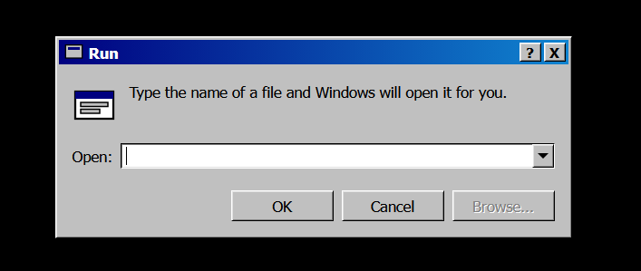

# FileHost

A tiny single-purpose ASP.NET Core app for serving files straight out of a folder over HTTP.
Drop a file in, it's live at `http://your-host/<filename>` immediately — no restart, no upload
step, no database, no admin panel.

## Why

Sometimes you just want a URL you can hand someone that downloads a file, without spinning up
a full object-storage bucket or dragging a GUI file server into the mix. FileHost is that in
its smallest useful form: point it at a folder, run it, and every file in that folder becomes a
direct-download link.

## Features

- **Drop-and-serve** — no indexing or database; the folder is scanned on each request, so
  adding, replacing, or removing a file takes effect instantly.
- **Resumable downloads** — HTTP range requests are supported, so paused/interrupted downloads
  can resume.
- **Optional per-file password protection** — put a file in a subfolder instead of the root and
  the subfolder's *name* becomes its HTTP Basic Auth password (see [Configuration](#configuration)).
- **A themed landing/404 page** instead of a blank error — requesting `/` or any filename that
  doesn't exist renders a page styled after the classic Windows "Run..." dialog:

  

  Typing a filename into the box and hitting OK requests that file from the server; a name
  that doesn't resolve pops the classic "Cannot find the file" error on top of it. Cancel and
  the title bar's X just clear the input box. The dropdown caret next to the input recalls the
  last 5 filenames that were successfully downloaded (kept in the browser's `localStorage`,
  per-browser — nothing is sent to or stored on the server).

## How it works

- `GET /<filename>` looks for `filename` directly in the configured folder and serves it if
  found (`Content-Disposition: attachment`, correct `Content-Type` guessed from the extension).
- If it's not there, the server checks one level of subfolders. A match in a subfolder requires
  HTTP Basic Auth where the password equals that subfolder's name (any username is accepted).
- If nothing matches, or the path is `/`, it falls back to the Run-dialog-styled page above,
  returning `404` for an unmatched filename lookup and `200` for the bare landing page.
- `GET /status` returns a plain "File host is running." for liveness checks.

## Configuration

Settings live in `appsettings.json` (or the equivalent environment variables, e.g.
`FileHosting__FolderPath`):

```json
{
  "Kestrel": {
    "Endpoints": {
      "Http": { "Url": "http://127.0.0.1:5177" }
    }
  },
  "FileHosting": {
    "FolderPath": "..\\Files"
  }
}
```

- **`FileHosting:FolderPath`** — required, no default. The folder to serve files from. A
  relative path is resolved against the app's own directory, not the working directory it
  happens to be launched from. The app fails fast at startup if this doesn't exist.

To password-protect a file, drop it into a subfolder of the configured folder instead of
directly in it — e.g. `Files\SomePassword\shared.zip`. The link is unchanged
(`http://your-host/shared.zip`), but the browser will prompt for credentials; any username
works, and the password must match the subfolder's name exactly. Multiple files can share one
password by living in the same subfolder. Only one level of subfolder nesting is supported.

## Running it locally

```powershell
dotnet run
```

Then visit `http://127.0.0.1:5177/` (or whatever `Kestrel:Endpoints:Http:Url` is set to).

## Deployment (Windows Server + Kestrel behind a reverse proxy/tunnel)

The steps below assume the self-hosted pattern this project was built for: a framework-dependent
publish, running as a Windows Service, sitting behind a reverse proxy or tunnel (e.g. IIS,
[Cloudflare Tunnel](https://developers.cloudflare.com/cloudflare-one/connections/connect-networks/),
nginx) that terminates TLS and forwards to Kestrel over loopback. Adjust paths/hostnames for
your own setup.

### 0. Check the ASP.NET Core Runtime is on the server

This is framework-dependent, so the server needs the **ASP.NET Core Runtime** (not just the base
.NET runtime — those are separate installs) matching the app's target, .NET 10.

```powershell
dotnet --list-runtimes
```

Look for a line starting with `Microsoft.AspNetCore.App 10.` in the output. If `dotnet` isn't
even recognized, or that line isn't there, install/update the hosting bundle before proceeding.

If `dotnet` isn't on PATH but something might still be installed, check disk directly:

```powershell
Get-ChildItem "C:\Program Files\dotnet\shared\Microsoft.AspNetCore.App"
```

To install/update, grab the **ASP.NET Core Runtime Hosting Bundle** (win-x64) for .NET 10 — it
installs the ASP.NET Core Runtime plus the IIS/ANCM module (harmless even without IIS) and
registers `dotnet` globally. After installing or updating it, restart if the service is already
running so it picks up the new shared runtime.

### 1. Publish (framework-dependent, win-x64)

```powershell
dotnet publish .\FileHost.csproj -c Release -r win-x64 --self-contained false -o C:\FileHost\App
```

Building this requires the .NET 10 **SDK** on whichever machine you publish from (can be your
dev box, not necessarily the server) — the server only needs the runtime from step 0.

### 2. Create the served-files folder

```powershell
New-Item -ItemType Directory -Force -Path C:\FileHost\Files
```

`appsettings.json` already points `FileHosting:FolderPath` at `..\Files`, relative to wherever
`FileHost.exe` itself lives (e.g. publishing to `C:\FileHost\App` serves from `C:\FileHost\Files`)
— no rebuild needed to relocate it, just edit the setting (or set the environment variable
`FileHosting__FolderPath`) to an absolute path if you'd rather pin it to a specific
drive/folder regardless of where the app is deployed.

### 3. Register the Windows Service

```powershell
sc.exe create FileHostService binPath= "C:\FileHost\App\FileHost.exe" start= auto
sc.exe description FileHostService "FileHost download service"
sc.exe start FileHostService
```

Note the required space after each `=` in `sc.exe` — that's `sc.exe` syntax, not a typo.

Confirm it's listening:

```powershell
Invoke-WebRequest http://127.0.0.1:5177/status -UseBasicParsing
```

Should return `File host is running.`

If you'd rather use NSSM instead of `sc.exe` (e.g. for easier log redirection):

```powershell
nssm install FileHostService "C:\FileHost\App\FileHost.exe"
nssm start FileHostService
```

### 4. Put it behind a reverse proxy or tunnel

Kestrel is configured to bind to `127.0.0.1` only, so it's not reachable from outside the
machine on its own — that's intentional, and means no inbound firewall rule is needed as long
as whatever fronts it (IIS, a tunnel, nginx, etc.) also runs on that machine and reaches it over
loopback. Point your reverse proxy or tunnel of choice at `http://127.0.0.1:5177` (or whatever
`Kestrel:Endpoints:Http:Url` is set to) and route your hostname of choice to it.

#### Example: exposing it with Cloudflare Tunnel

This is how the original deployment this project was built for is exposed, using
[`cloudflared`](https://developers.cloudflare.com/cloudflare-one/connections/connect-networks/)
so nothing needs to be port-forwarded or opened on the firewall at all.

If you don't already have a tunnel, create one and log in first:

```powershell
cloudflared tunnel login
cloudflared tunnel create <tunnel-name>
```

That registers the tunnel and writes a credentials file (`<tunnel-id>.json`); reference both in
`config.yml`:

```yaml
tunnel: <tunnel-id>
credentials-file: C:\path\to\<tunnel-id>.json

ingress:
  - hostname: files.example.com
    service: http://localhost:5177
  - service: http_status:404
```

If you're already running `cloudflared` for other services on the same box, just add an ingress
rule for this one above the catch-all instead of creating a separate tunnel:

```yaml
ingress:
  - hostname: some-other-service.example.com
    service: http://localhost:8096
  - hostname: files.example.com
    service: http://localhost:5177
  - service: http_status:404
```

Restart the tunnel service to pick up the config change:

```powershell
Restart-Service cloudflared
```

Then route the DNS hostname to the tunnel:

```powershell
cloudflared tunnel route dns <tunnel-name-or-id> files.example.com
```

If `cloudflared` isn't installed as a service yet:

```powershell
cloudflared service install
```

## Notes

- Dropping a file into the configured folder makes it live immediately at
  `http://your-host/<filename>` — no restart, no registration step.
- Filenames are taken literally as URL path segments, so avoid characters that need unusual
  encoding (spaces are fine — the browser/OS handles the encoding).
